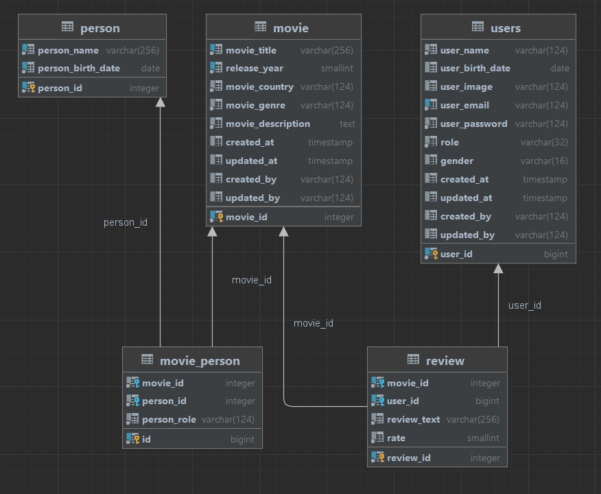
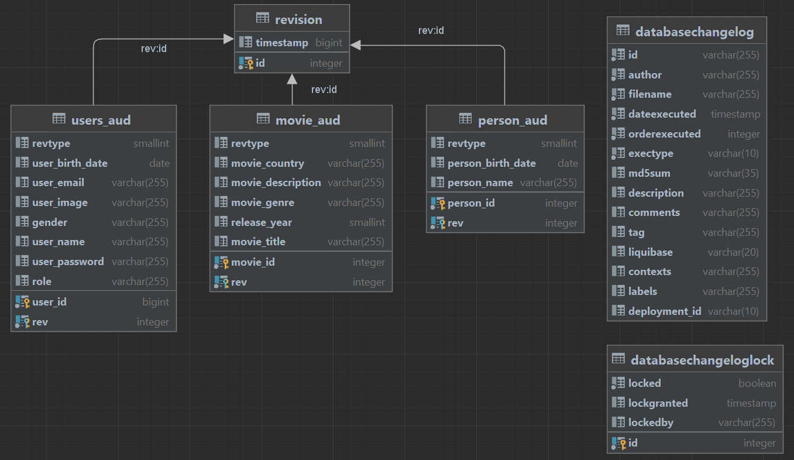

# Video Library

This is a pet project.
In this project I wanted to show my work with the following technologies/tools:

- Java 21
- Spring Boot 3:
    - Data Jpa
    - Data Envers
    - Web
    - Thymeleaf
    - Validation
    - Security
    - AOP
- Swagger
- Postgres
- Querydsl
- Gradle
- Liquibase
- Lombok
- Docker
- Docker Testcontainers
- JUnit5 (Mockito, AssertJ)
- Jacoco
- Git

## Prerequisites

Docker must be installed on your computer.

## How to get and run application

**First, make sure you have Docker up and running, and also that ports 8082 and 5433 are free.**

The following set of commands will set permissions to execute start-app(-compose) and stop-app(-compose) scripts.

````
chmod +x start-app
chmod +x stop-app
````

or if you want to use Docker Compose to run the application.

````
chmod +x start-app-compose
chmod +x stop-app-compose
````

To start the app, run the following script.
It will build the project, start docker containers for postgres and video-library and set up a network
between them. Then it will automatically open video-library start page in the browser under
the localhost.

````
./start-app
````

or

````
./start-app-compose
````

To stop docker containers for Postgres and Video Library and remove network between them, run the cleanup script:

````
./stop-app
````

or

````
./stop-app-compose
````

There are two predefined users that you can use:

- Admin - login: admin@gmail.com, password: **998**
- User - login: user1@gmail.com, password: **123**

## Implementation

- MVC
- REST API
- Auditing with JPA
- Entity revisions managed by Hibernate Envers
- Availability of filtering queries with pagination.(HQL, Querydsl)
- Using Rest Controller when working with statics(images)
- Using Controller Advice and Rest Controller Advice to handle all application errors
- OAuth 2 Authorization
- Using Spring JSR-303 for validation

## Key features

- This application is a movie catalog with a following functionality:
    - All users:
        - Filter movies using various filter options
        - View detailed information about films, including film participants (actors/directors/producers/composers) and
          user reviews
        - View detailed information about the film participants (list of each participant's other projects, etc.)
        - Adding reviews for movies
        - View reviews from a specific user
    - Admins only:
        - Adding new movies to the library
        - Adding new movie participants
        - Updating existing movies/film participants/users
        - Deleting existing movies/film participants/users
- Login/registration/logout are available
- There is localization available for three languages: `English` and `Russian`

## Database structure




#### Test Coverage - 86% (Unit and Integration tests)
